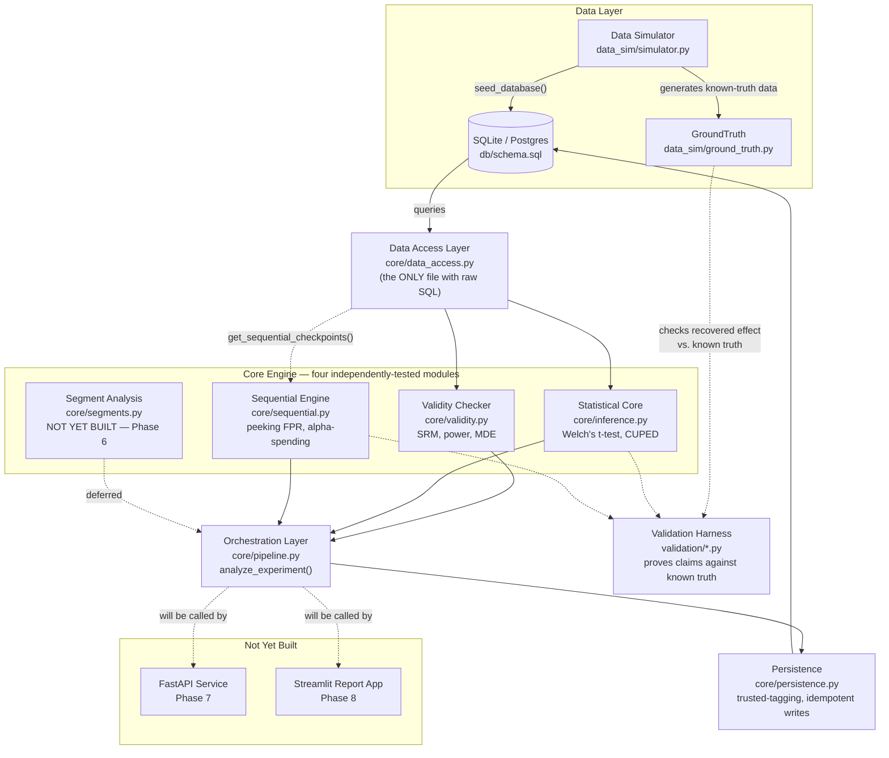

# A/B Test Analysis Engine

Structural enforcement of correct experimentation methodology — SRM detection,
power analysis, CUPED variance reduction, empirical peeking-inflation
correction, and (planned) BH-corrected segment heterogeneity — validated
against synthetic data with known ground truth, not asserted from a single run.

> **Status:** Phases 0–5 built, tested, and validated. Orchestration layer
> (`core/pipeline.py`) wires those phases into one end-to-end pipeline for a
> single experiment. Segment analysis (Phase 6), API layer (Phase 7), and the
> Streamlit report app (Phase 8) are not yet built.

## Setup

```bash
git clone <repo_url>
cd ab-test-engine
python -m venv venv && source venv/bin/activate   # Windows: venv\Scripts\activate
pip install -r requirements.txt
pytest -m "not slow"
```

Runs in under 15 seconds and requires zero external services — SQLite only,
per NFR5.

To run the slower, simulation-based validation suite (release-gate evidence,
not a per-commit check — takes a few minutes):

```bash
bash scripts/run_validation_suite.sh
```

## Why this exists

Naive `p < 0.05` A/B testing fails in four specific, well-documented ways:

- **Underpowered or over-run tests** — no pre-registered sample size means
  teams either stop too early or run indefinitely past the point of value.
- **Peeking / repeated significance testing** — checking a dashboard daily
  and stopping the moment `p < 0.05` appears inflates the true false-positive
  rate far above the nominal 5%, invisibly.
- **Sample ratio mismatch (SRM)** — a broken randomization pipeline can
  silently invalidate every downstream statistic.
- **Simpson's paradox / effect heterogeneity** — an aggregate null can mask
  a strong effect in one segment and the opposite effect in another.

This engine makes the relevant checks mandatory and ordered, computes what
naive workflows skip (power, SRM, CI, calibrated peeking correction), and
proves its own claims against synthetic data with a known ground-truth
effect — every validation number below was measured by actually running the
code, not asserted from theory.

## Architecture



The dashed box (Core Engine) is deliberate: each of its four modules is pure,
independently testable, and has zero awareness of the others. `core/
persistence.py` is the *only* place two of them (validity + inference) are
allowed to meet, and it's structured so that meeting cannot happen
incorrectly — `trusted` is computed from the SRM result internally, never
accepted as a caller-supplied argument.

## Project structure

```
ab-test-engine/
├── core/
│   ├── validity.py       # SRM chi-square check, power/MDE calculator
│   ├── inference.py      # Welch's t-test, CUPED adjustment, variance reduction
│   ├── sequential.py     # peeking-FPR simulation, alpha-spending correction
│   ├── persistence.py    # the only writer of experiment_results.trusted
│   ├── data_access.py    # the only file with raw SQL
│   └── pipeline.py       # orchestration: ties the above into one report
├── data_sim/
│   ├── simulator.py      # ExperimentSimulator — synthetic data, known ground truth
│   └── ground_truth.py   # immutable record of configured-vs-realized parameters
├── db/
│   ├── schema.sql
│   ├── connection.py
│   └── seed.py
├── tests/                # fast, closed-form/structural tests (pytest -m "not slow")
├── validation/           # slow, simulation-based proof (release gate, not per-commit)
├── config/
├── scripts/
├── api/                  # empty — Phase 7
├── app/                  # empty — Phase 8
└── notebooks/            # empty — Phase 9
```

## Validation evidence

Measured by actually running `validation/*.py`, not asserted — see
`validation/validation_report.md` for the full writeup.

| Claim | Target | Measured | Notes |
|---|---|---|---|
| CI coverage (`raw_ttest_ci`, 1000 sims) | 93%–97% | **94.4%** | n=2000/arm, baseline=0.10, effect=0.02. ~0.8 SE from nominal. |
| CUPED variance reduction @ ρ=0.3 | ≈9.0% (100·ρ²) | **9.07%** | 200 sims, n=5000/arm. 0.95 SE from theory. |
| CUPED variance reduction @ ρ=0.7 | ≈49.0% | **48.95%** | Same config. 0.33 SE from theory. |
| Naive peeking empirical FPR | 20%–35% | **22.0%** (110/500) | 10 checkpoints × 200/arm, flat α=0.05. |
| Alpha-spending corrected FPR | ~4%–6.5% | **6.6%** (33/500) | Identical data (common random numbers). |

The naive→corrected trigger-position shift (naive triggers front-loaded at
early checkpoints; corrected triggers shifted almost entirely to the final
checkpoint) is direct evidence the correction targets the intended failure
mode — early-look noise — not just a uniform threshold reduction.

## Known limitations (stated directly, not discovered later)

- CI coverage validated at **one** configuration only (n=2000, baseline=0.10).
  Behavior at much smaller n or extreme baseline rates is unverified.
- CUPED variance reduction validated only at `true_effect=0` on a **binary**
  outcome. Nonzero-effect and continuous-metric behavior is unverified.
- The alpha-spending schedule is the standard closed-form O'Brien-Fleming
  **approximation**, not the exact Lan–DeMets spending function — exact 5.0%
  alpha preservation isn't guaranteed (measured 6.6% reflects this).
- Checkpoints are evenly spaced (fixed 200-observation increments); irregular
  real-world checkpoint timing is unvalidated.
- `core/pipeline.py`'s sequential-peeking check is genuinely optional: the
  schema has no column storing an experiment's *planned* checkpoint schedule
  (`n_checkpoints_planned`, `checkpoint_n`), so these must be supplied by the
  caller. This is a real schema gap, not a shortcut.
- Segment-level analysis (Simpson's-paradox detection, BH correction) is not
  yet built — `AnalysisReport.segments` is always `None`.

## Roadmap

- [x] Phase 0 — environment & repo scaffold
- [x] Phase 1 — synthetic data simulator with known ground truth
- [x] Phase 2 — SRM detection, power/MDE
- [x] Phase 3 — raw inference, CUPED, trust-tagged persistence
- [x] Phase 4 — ground-truth validation harness
- [x] Phase 5 — sequential testing / peeking correction
- [x] Orchestration layer (`core/pipeline.py`) tying Phases 2–5 together
- [ ] Phase 6 — segment analysis / Simpson's-paradox detection
- [ ] Phase 7 — FastAPI service layer (stretch)
- [ ] Phase 8 — Streamlit report app
- [ ] Phase 9 — documentation, packaging, portfolio writeup