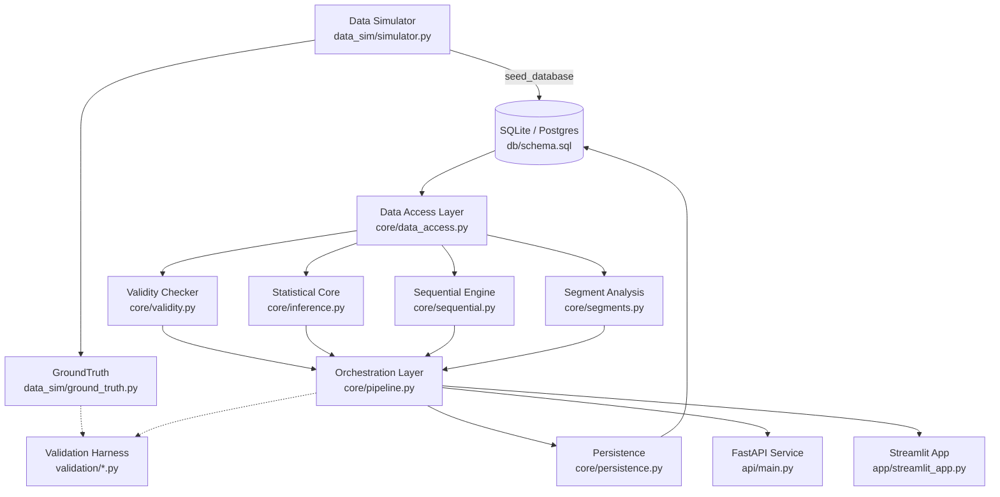

# A/B Test Analysis Engine

Structural enforcement of correct experimentation methodology — SRM detection,
power analysis, CUPED variance reduction, empirical peeking-inflation
correction, and BH-corrected Simpson's-paradox-aware segment analysis —
validated against synthetic data with known ground truth, not asserted from
a single run. Exposed both as a Python library, a REST API, and an
interactive report app.

> **Status:** Phases 0–8 complete — statistical core, orchestration layer,
> segment analysis, FastAPI service, and Streamlit report app all built,
> tested, and validated. Phase 9 (this document, notebook writeup,
> packaging) in progress.

## Quick start

```bash
git clone <repo_url>
cd ab-test-engine
python -m venv venv && source venv/bin/activate   # Windows: venv\Scripts\activate
pip install -r requirements.txt
pytest -m "not slow"
```

Runs in under 10 seconds and requires zero external services — SQLite only,
per NFR5.

**Try the interactive report app:**
```bash
streamlit run app/streamlit_app.py
```

**Try the API** (auto-generated interactive docs at `/docs`):
```bash
uvicorn api.main:app --reload
```

**Run the full validation suite** (release-gate evidence, not a per-commit
check — several minutes):
```bash
pytest validation/ -v -s -m slow --tb=short
```

## Why this exists

Naive `p < 0.05` A/B testing fails in four specific, well-documented ways:

- **Underpowered or over-run tests** — no pre-registered sample size means
  teams either stop too early or run indefinitely past the point of value.
- **Peeking / repeated significance testing** — checking a dashboard daily
  and stopping the moment `p < 0.05` appears inflates the true false-positive
  rate far above the nominal 5%, invisibly.
- **Sample ratio mismatch (SRM)** — a broken randomization pipeline can
  silently invalidate every downstream statistic.
- **Simpson's paradox / effect heterogeneity** — an aggregate null can mask
  a strong effect in one segment and the opposite effect in another.

This engine makes the relevant checks mandatory and ordered, computes what
naive workflows skip (power, SRM, CI, calibrated peeking correction,
segment-level heterogeneity), and proves its own claims against synthetic
data with a known ground-truth effect — every validation number below was
measured by actually running the code, not asserted from theory.

## Architecture



The dashed box (Core Engine) is deliberate: each of its four modules is pure,
independently testable, and has zero awareness of the others except where
the spec explicitly calls for reuse (`core/segments.py` reuses
`core/inference.py`'s `raw_ttest_ci()` directly, mirroring the pooled
estimate). `core/persistence.py` is the *only* place validity and inference
results are allowed to meet, and it's structured so that meeting cannot
happen incorrectly — `trusted` is computed from the SRM result internally,
never accepted as a caller-supplied argument.

**API and Streamlit both call `core/pipeline.py` directly**, not each other
— a deliberate choice (documented in `Phase_8_Documentation.md`) favoring
simplicity for a local demo tool over an unnecessary HTTP round-trip.

## Project structure

```
ab-test-engine/
├── core/
│   ├── validity.py       # SRM chi-square check, power/MDE calculator
│   ├── inference.py      # Welch's t-test, CUPED adjustment, variance reduction
│   ├── sequential.py     # peeking-FPR simulation, alpha-spending correction
│   ├── segments.py       # per-segment effect estimation, BH correction, Simpson's-paradox flag
│   ├── persistence.py    # the only writer of experiment_results.trusted
│   ├── data_access.py    # the only file with raw SQL
│   └── pipeline.py       # orchestration: ties the above into one report
├── data_sim/
│   ├── simulator.py      # ExperimentSimulator — synthetic data, known ground truth
│   └── ground_truth.py   # immutable record of configured-vs-realized parameters
├── db/
│   ├── schema.sql
│   ├── connection.py
│   └── seed.py           # seed_database() + seed_assignments_for_existing_experiment()
├── api/
│   ├── main.py            # FastAPI app, auto-docs at /docs
│   ├── schemas.py          # Pydantic request/response models
│   └── routers/
│       ├── experiments.py  # POST /experiments, POST /experiments/{id}/assign
│       └── analysis.py     # POST /experiments/{id}/analyze, GET /experiments/{id}/report
├── app/
│   ├── streamlit_app.py    # single-page report entrypoint
│   └── components/         # 5 panels: upload_or_generate, validity, effect, sequential, segment
├── tests/                # fast, closed-form/structural tests (pytest -m "not slow")
├── validation/           # slow, simulation-based proof (release gate, not per-commit)
├── notebooks/            # narrative walkthrough (Phase 9)
├── config/
└── scripts/
```

## Validation evidence

Measured by actually running `validation/*.py`, not asserted — see
`validation/validation_report.md` for the full writeup.

| Claim | Target | Measured | Notes |
|---|---|---|---|
| CI coverage (n=2000, baseline=0.10) | 93%–97% | **94.4%** | Original configuration, 1000 sims. |
| CI coverage (small n=400) | 93%–97% | **94.4%** | Stress-tests Welch's df approximation at smaller n. |
| CI coverage (low baseline=0.02) | 93%–97% | **95.0%** | Stress-tests skew near the probability boundary. |
| CI coverage (high baseline=0.90) | 93%–97% | **95.4%** | Symmetric boundary stress test. |
| CUPED variance reduction @ ρ=0.3, null effect | ≈9.0% | **9.21%** | 200 sims, n=5000/arm. |
| CUPED variance reduction @ ρ=0.7, null effect | ≈49.0% | **48.67%** | Same config. |
| CUPED variance reduction, nonzero true effect | ≈25.0% | **23.87%** | Real, documented ~1pp systematic shift from effect-application mechanics — see validation file docstring. |
| CUPED variance reduction, continuous metric | ≈36.0% | **35.94%** | Proves the identity is metric-agnostic, not binary-only. |
| Naive peeking empirical FPR | 20%–35% | **22.0%** (110/500) | 10 checkpoints × 200/arm, flat α=0.05. |
| Alpha-spending corrected FPR | ~4%–6.5% | **6.6%** (33/500) | Identical data (common random numbers). |
| Corrected FPR under irregular checkpoint spacing | Must beat naive | **6.8%** vs naive **21.4%** | Uneven daily-style spacing; no meaningful degradation vs. even spacing. |
| Segment recovery (deliberately heterogeneous) | Correct sign, magnitude within noise | **Mobile: +0.147** (configured +0.15); **Desktop: -0.070** (configured -0.08) | Simpson's-paradox flag correctly fired on the disagreeing segment. |

The naive→corrected trigger-position shift (naive triggers front-loaded at
early checkpoints; corrected triggers shifted almost entirely to the final
checkpoint) is direct evidence the correction targets the intended failure
mode — early-look noise — not just a uniform threshold reduction.

## Known limitations (stated directly, not discovered later)

- The alpha-spending schedule is the standard closed-form O'Brien-Fleming
  **approximation**, not the exact Lan–DeMets spending function, and remains
  **index-based** (checkpoint count) rather than information-based (actual
  sample-size ratio) even under irregular spacing — validated to still work
  well in practice, but not a first-principles redesign.
- `core/pipeline.py`'s sequential-peeking check is genuinely optional: the
  schema has no column storing an experiment's *planned* checkpoint schedule
  (`n_checkpoints_planned`, `checkpoint_n`), so these must be supplied by the
  caller. This is a real schema gap, not a shortcut.
- `GET /experiments/{id}/report` recomputes the analysis rather than reading
  purely from persisted data, deviating from the original spec's literal
  wording — `experiment_results`'s schema doesn't store enough fields
  (p-value, standard error, etc.) to reconstruct a full report otherwise.
  Documented in `api/routers/analysis.py`.
- The API's `POST /experiments/{id}/assign` only supports `mode="simulate"`;
  real-data ingestion (`mode="ingest"`) is deferred to the Streamlit app's
  upload flow.
- The Streamlit app's CSV upload requires data already shaped like
  `get_inference_data()`'s output (one row per user) — it does not
  reconstruct a full multi-table schema from an arbitrary spreadsheet.
